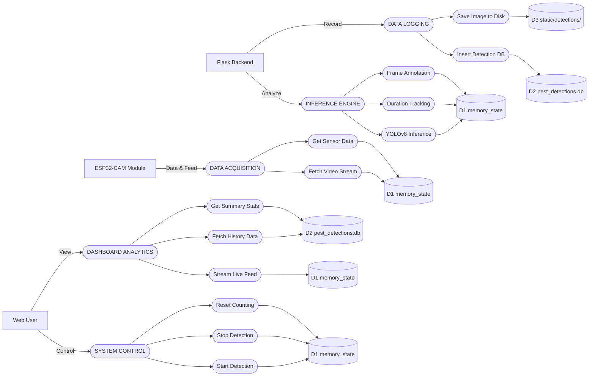

# DFD Level 1: Real-Time Pest Detection System Explanation

This document provide a detailed breakdown of the Level 1 Data Flow Diagram (DFD) for the Real-Time Pest Monitoring System.

---

## 1. External Entities
*   **E1: Web User**: The human operator interacting with the system via a web browser. They send **Control** signals (Start/Stop) and receive **View** data (Live Feed/Stats).
*   **E2: ESP32-CAM Module**: The hardware edge device. It provides the raw MJPEG video stream and ultrasonic sensor data via HTTP endpoints.
*   **E3: Flask Backend**: The central coordination logic (running on the Raspberry Pi) that initiates analysis and handles the recording logic.

---

## 2. Main Processes
### P1: SYSTEM CONTROL
Manages the operational state of the engine (Start/Stop/Reset).

### P2: DASHBOARD ANALYTICS
Handles the presentation of live frames, historical logs, and statistical aggregations for the user interface.

### P3: DATA ACQUISITION
Retrieves raw video streams and ultrasonic distance sensor data from the hardware.

### P4: INFERENCE ENGINE
Processes raw frames using **YOLOv8**, performs duration-based tracking to filter noise, and annotates frames with bounding boxes.

### P5: DATA LOGGING
Exports confirmed detection events to the SQLite database and saves annotated image proof to the local file system.

---

## 3. Data Stores
*   **D1: memory_state**: Volatile RAM used for live frame buffering and detection timers.
*   **D2: pest_detections.db**: SQLite database for permanent logs.
*   **D3: static/detections/**: Storage for high-resolution image proof.

---

## 4. Key Data Flow Path
1.  **ESP32-CAM (E2)** streams data to **Data Acquisition (P3)**.
2.  **Inference Engine (P4)** analyzes the stream and updates **Memory (D1)**.
3.  On confirmation, **Data Logging (P5)** saves to **Database (D2)** and **Disk (D3)**.
4.  **Web User (E1)** reviews live and logged data via the **Dashboard (P2)**.
